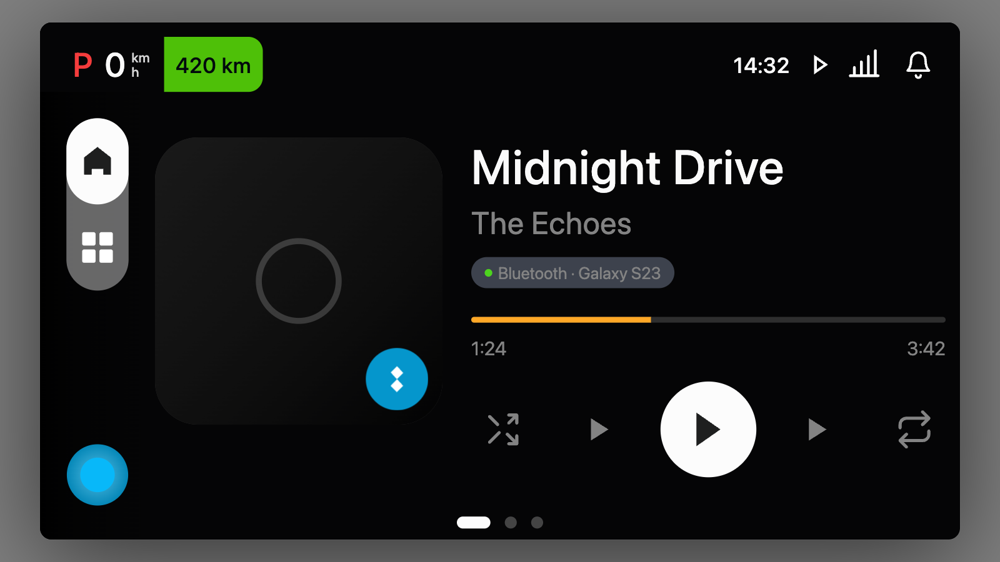

# DeepSeek Design Prompt

A portable design-system prompt and DeepSeek TUI skill for generating polished HTML/CSS/JS design artifacts.

This prompt is intended to make DeepSeek behave more like a focused digital product designer: it reads real design context, respects UI kits and design systems, avoids generic AI-design tropes, and produces usable artifacts such as prototypes, dashboards, decks, landing pages, mobile screens, and design-system previews.

## What is included

- [`Deepseek Design System Prompt.md`](./Deepseek%20Design%20System%20Prompt.md) - standalone prompt text for API or manual system-prompt use.
- [`skills/deepseek-design/SKILL.md`](./skills/deepseek-design/SKILL.md) - installable DeepSeek TUI skill version.

## When to use it

Use this prompt or skill when you want DeepSeek to create:

- Product prototypes
- Automotive HMI screens
- Dashboards and operational tools
- Slide decks and fixed-size HTML presentations
- Landing pages and marketing pages
- Design-system previews
- HTML artifacts grounded in a real UI kit or codebase

It works best when paired with real context: a `DESIGN.md`, a UI kit, component HTML files, tokens, screenshots, or existing product code.

## Install as a DeepSeek TUI skill

Clone this repository:

```bash
git clone https://github.com/mailbobg/deepseek-design-prompt.git
cd deepseek-design-prompt
```

### Option A: project-local install

Use this when you want the skill to apply only inside one workspace.

```bash
mkdir -p /path/to/your/project/.agents/skills
cp -R skills/deepseek-design /path/to/your/project/.agents/skills/deepseek-design
```

Then launch DeepSeek TUI from that project:

```bash
cd /path/to/your/project
deepseek
```

In DeepSeek TUI, run:

```text
/skills
```

Confirm that `deepseek-design` is listed, then use it for design tasks.

### Option B: global install

Use this when you want the skill available across projects.

```bash
mkdir -p ~/.deepseek/skills
cp -R skills/deepseek-design ~/.deepseek/skills/deepseek-design
```

Restart DeepSeek TUI and check:

```text
/skills
```

If your DeepSeek TUI build also reads `~/.agents/skills`, you can install there instead:

```bash
mkdir -p ~/.agents/skills
cp -R skills/deepseek-design ~/.agents/skills/deepseek-design
```

DeepSeek TUI skill discovery can vary by version. In tested builds, common discovery locations include project `.agents/skills`, project `skills`, and global `~/.deepseek/skills`.

## Use as an API/system prompt

If you are calling DeepSeek through an API or another agent wrapper, copy the contents of:

```text
Deepseek Design System Prompt.md
```

Use it as the system prompt or as the highest-priority design instruction before the user brief.

Recommended prompt stack:

```text
1. DeepSeek Design System Prompt
2. Project DESIGN.md or brand guide
3. UI kit/component inventory
4. User brief
5. Required output format
```

## Recommended project layout

For best results, place the skill alongside design-system and UI kit files:

```text
your-project/
├── .agents/
│   └── skills/
│       └── deepseek-design/
│           └── SKILL.md
├── DESIGN.md
├── kit/
│   ├── tokens.css
│   ├── primitives/
│   ├── molecules/
│   └── organisms/
├── pages/
│   └── ...
└── references/
    └── ...
```

Then ask DeepSeek to read the relevant files before generating:

```text
Use the deepseek-design skill. Read DESIGN.md, kit/tokens.css, kit/INVENTORY.md,
and the relevant components under kit/. Create a 1920x1080 HTML prototype for
the main media screen. Use real tokens and components from the UI kit.
```

## Example: SWP UI kit + deepseek-design skill

This prompt was tested with an automotive SWP UI kit workflow. The skill was installed in the UI kit project under:

```text
/Users/bobmax/Desktop/swp-ui-kit/.deepseek/skills/deepseek-design/SKILL.md
```

Generated media prototype screenshot:



The prototype uses the SWP UI kit tokens and component vocabulary, including dark cockpit surfaces, RTOS status structure, sidebar navigation, media controls, source switching, queue views, and large automotive HMI hit targets.

The screenshot was captured from the generated SWP media prototype HTML.

## Example prompts

### UI kit grounded prototype

```text
Use the deepseek-design skill. Read the design system and UI kit files first.
Create a 1920x1080 automotive HMI media prototype using real tokens and components.
Include now playing, source switching, queue, sidebar navigation, and realistic empty/error states.
Write the result as a runnable HTML file.
```

### Dashboard

```text
Use the deepseek-design skill. Create a dense operational dashboard from the provided data.
Prioritize scanability, filters, tabular numerics, status indicators, and realistic interaction states.
Avoid decorative hero sections and fake metrics.
```

### Slide deck

```text
Use the deepseek-design skill. Create an 8-slide HTML deck with a fixed 16:9 canvas.
Persist slide position in localStorage, include keyboard navigation, and keep each slide to one idea.
Use the provided brand/design system tokens.
```

## Design guardrails

The prompt explicitly discourages:

- Generic purple/blue gradients
- Decorative blobs and random glow effects
- Emoji feature icons
- Fake metrics and unsupported claims
- Lorem ipsum and placeholder feature labels
- Cards inside cards
- Unreadable responsive text
- Recreating proprietary branded interfaces without permission

## License

No license has been selected yet. Add a license before distributing or accepting contributions.
